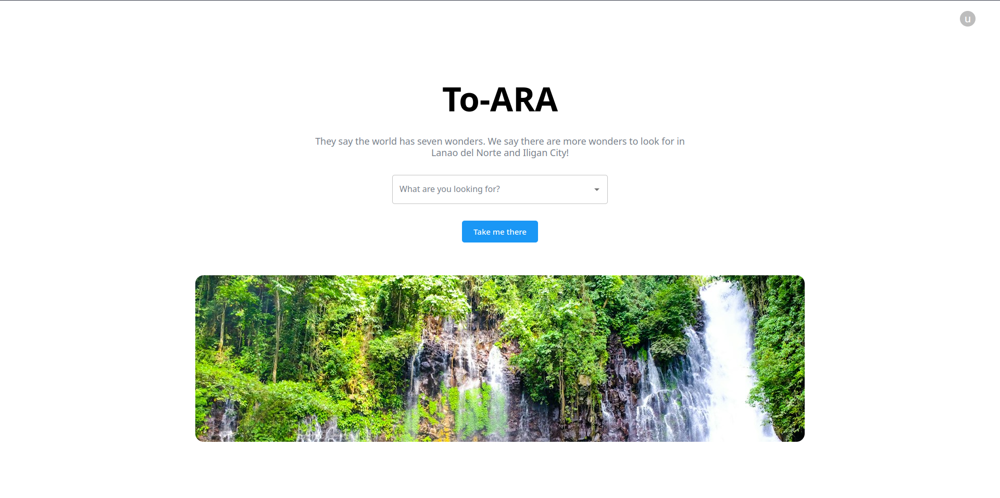
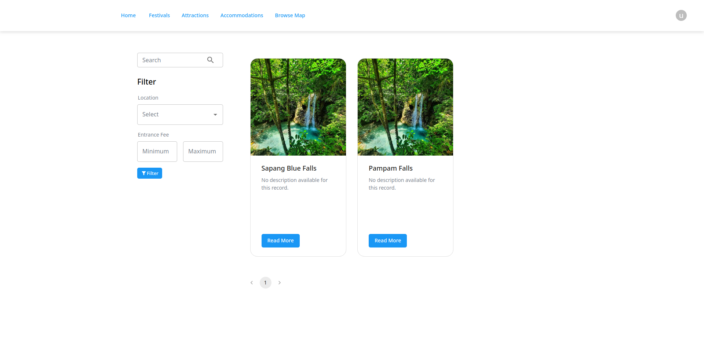
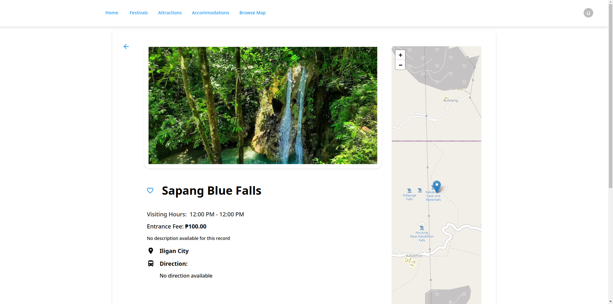
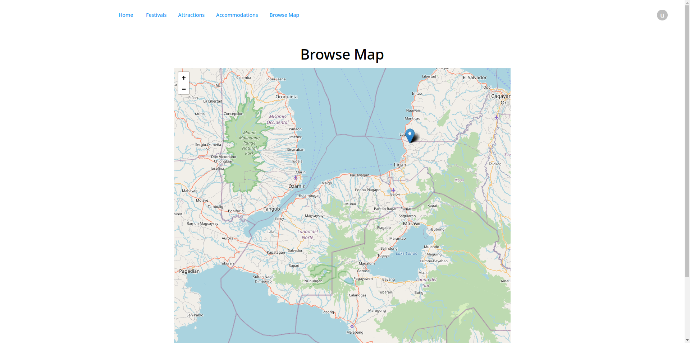

# To-ARA

## About

Welcome to the To-ARA! This web application serves as your go-to platform for exploring the most renowned tourist attractions, accommodations, and festivals within Lanao del Norte. Empowered by modern web technologies, including ReactJS, Node.js, and PostgreSQL, our platform aims to provide a comprehensive and immersive experience for travelers and locals alike.

## Features

- **Attraction Exploration:** Discover and learn about the top tourist attractions that Lanao del Norte has to offer.

- **Accommodation Listings:** Explore various accommodations, from cozy inns to luxurious hotels, to make your stay memorable.

- **Festival Listings:** Stay updated with a comprehensive calendar showcasing the region's vibrant festivals and events.

- **Responsive Design:** Our user-friendly interface ensures seamless browsing across devices, providing a hassle-free experience.

## Screenshots

## Installation

1. Clone the repository: `git clone https://github.com/miggy-pg/to-ara`
2. Navigate to the project directory: `cd to-ara`
3. Install dependencies: `npm install`

## Usage

1. Run the application: `npm start`
2. Open your preferred browser and go to: `http://localhost:5173`
3. Start exploring the beautiful offerings of Lanao del Norte!

## Technologies Used

## Contributing

Contributions are welcomed! To contribute to the Lanao del Norte Tourism Guide:

1. Fork the repository.
2. Create a new branch: `git checkout -b feature/your-feature-name`
3. Make your changes and commit them: `git commit -m "Add some feature"`
4. Push to your forked repository: `git push origin feature/your-feature-name`
5. Create a pull request.

## Contact

Feel free to reach out to me via email at phillip.mgalan@gmail.com or connect with me on [LinkedIn](https://www.linkedin.com/in/migui-galan/).
